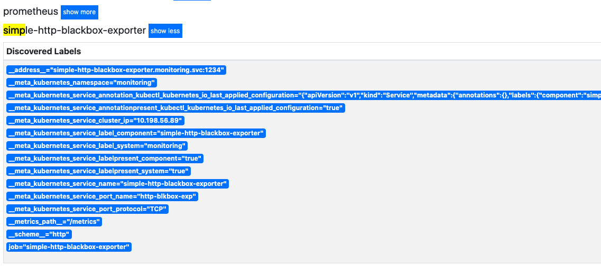

# Simple HTTP BlackBox Exporter
A PoC project that implements a working Prometheus exporter that can monitor public URLs for a status code.

* [Summary](#summary)
  * [Metrics](#metrics)
  * [Flags](#flags)
  * [Configuration](#configuration)
  * [Logging](#logging)
* [How To Build](#how-to-build)
  * [Run test](#run-test)
  * [Build the tool](#build-the-tool)
  * [Create the docker container](create-the-docker-container)
  * [Run the container locally](#run-the-container-locally)
* [How to deploy](#how-to-deploy)
  * [Deploy on kubernetes](#deploy-on-kubernetes)
  * [Delete the deployment](#delete-the-deployment)
  * [Add to prometheus](#add-to-prometheus)
  * [Create Grafana dashboard](#create-grafana-dashboard)

## Summary
This exporter can be scraped on a given URL and it will return if the url is UP (returns a OK status code)
and the time it took to finish (the response time).

### Metrics

```
# HELP sample_external_url_up Whether the URL is up and running.
# TYPE sample_external_url_up gauge
sample_external_url_up{url="https://example.com"} 1
# HELP sample_external_url_response_ms The amount of time it took for the http request to finish (in milliseconds).
# TYPE sample_external_url_response_ms gauge
sample_external_url_response_ms{url="https://example.com"} 197
```

### Flags

The tool accepts two flags:
- `listen-address`: The address to expose the metrics in prometheus format. Default value is: 1234
- `config`: A yaml config file with settings and services to monitor. Default value is: config.yaml

### Configuration

Currently, the tool only supports a configuration provided by a config file in YAML format.
The config file stores a list of URLs. Here is an example of a config file:

```
urls:
  - https://httpstat.us/200
  - https://httpstat.us/503
```

### Logging

For the time being there is only one log level - info.
Here is an example of the stdout output of the exporter while being scraped:

```
time="2020-04-25T13:00:39Z" level=info msg="Listening on :1234" source="main.go:126"
time="2020-04-25T13:00:46Z" level=info msg="client.Get to https://httpstat.us/200 took 1238 milliseconds.\n" source="main.go:59"
time="2020-04-25T13:00:46Z" level=warning msg="client.Get failed to get to https://httpstat.us/503 - status code: 503.\n" source="main.go:63"
time="2020-04-25T13:00:49Z" level=info msg="client.Get to https://httpstat.us/200 took 197 milliseconds.\n" source="main.go:59"
time="2020-04-25T13:00:49Z" level=warning msg="client.Get failed to get to https://httpstat.us/503 - status code: 503.\n" source="main.go:63"
```

## How to build

### Run test
To run the unit tests, please do:

```sh
cd cmd/simple-http-blackbox-exporter
go test ./
```

### Build the tool
To build the tool and produce a binary, please do:

```sh
cd cmd/simple-http-blackbox-exporter
go build main.go
```

You will have your binary for your operation system in the same directory with the name of the
project `simple-http-blackbox-exporter`.

To build the binary for a different OS, please do:

Windows:
```sh
GOOS=windows go build main.go
```

Linux:
```sh
GOOS=linux go build main.go
```

MacOS:
```sh
GOOS=darwin go build main.go
```

### Create the docker container

```sh
docker build -t simple-http-blackbox-exporter:v0.1 .
docker tag simple-http-blackbox-exporter:v0.1 mihailgmihaylov/simple-http-blackbox-exporter:v0.1
docker push mihailgmihaylov/simple-http-blackbox-exporter:v0.1
```

### Run the container locally

```sh
docker run -p 1234:1234 -v \
  ${GOPATH}/src/github.com/simple-http-blackbox-exporter/cmd/simple-http-blackbox-exporter/config.yaml:/go/config.yaml:ro \
  mihailgmihaylov/simple-http-blackbox-exporter:v0.1 -config=/go/config.yaml
```

To test if everything is working simply query the metrics:

```sh
curl http://localhost:1234/metrics
```

## How to deploy

The following directory provides examples on how to deploy the exporter on kubernetes cluster and scrape it with Prometheus.
Bare in mind that the code may have to be tailored for your system.

[examples](./examples)

### Deploy on kubernetes

```sh
kubectl apply -f ./examples/kubernetes-manifest.yaml
```

The following manifest will deploy:
- Namespace for this exporter to reside in
- PodSecurityPolicy with the minimal required permissions for this application.
- ServiceAccount for the deployment so that the PodSecurityPolicy can be attached and used for the pods.
- Role and RoleBinding to bind the PodSecurityPolicy to the ServiceAccount
- ConfigMap that stores the configuration - the list of URLs to query.
- Deployment that will actually store the application.
- Service that binds the pods of the deployment under one service.
- NetworkPolicy to limit the traffic to the application and allow queries only from Prometheus.

### Delete the deployment

To delete the deployment just:

```sh
kubectl delete -f ./examples/kubernetes-manifest.yaml
```

Or simply delete the namespace (if there is nothing else deployed there):

```sh
kubectl delete ns monitoring
```

### Add to prometheus

In this file [./examples/prometheus-config.yaml](./examples/prometheus-config.yaml) you can find a example of a Prometheus job
with which you can scrape the exporter.




### Create Grafana dashboard

In this file [./examples/Grafana-dashboard.json](./examples/Grafana-dashboard.json) you can find a example of a Prometheus job
with which you can scrape the exporter.


